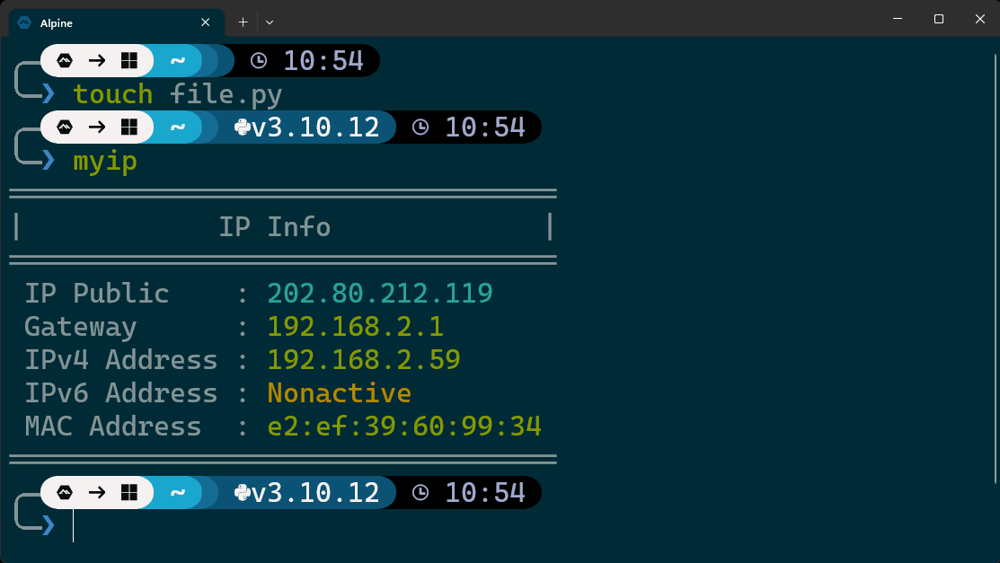
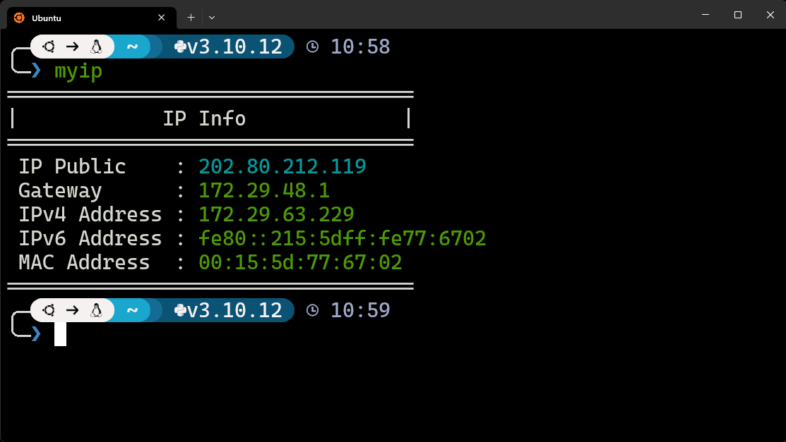

Hi, there! I'm here.. 👋

These **dotfiles** contains my personal linux and windows configuration files. I'm just too lazy to rebuild new machine from scratch, and take it from arrggghh to yeah. The goal is to create a terminal ecosystem like Termux on Android, WSL1, WSL2, Ubuntu, Arch, and other (common) distro, making it easy with one command on any distribution.

# My Terminal Interface
Personally, I'm using [Nerd-Fonts](https://www.nerdfonts.com/) for displaying icon on my terminal on [this screenshot](#screenshot). Currently using **Caskaydia Cove Nerd Font Complete Mono Windows Compatible Regular**

# Install

**Hide Repo Directory**
```
git clone https://github.com/dotcreep/dotfiles.git .dotfiles && (cd .dotfiles && bash install.sh)
```

**Show Repo Directory**
```
git clone https://github.com/dotcreep/dotfiles.git && (cd dotfiles && bash install.sh)
```

# Shortcut Example

**Package Manager**

Minimize Shortcut | Shortcut | Function
--- | --- | ---
`i` | `install` | Install Package
`inc` | `installnc` | Install Package without confirm
`u` | `update` | Update Repository
`uu` | `upgrade` | Upgrade Packages
`uuu` | `updateupgrade` | Update Repo and Upgrade Package
`r` | `remove` | Uninstall Package
`ri` | `reinstall` | Reinstall package
`d` | `detail` | Detail Package
`o` | `orphan` | Remove Non-used Packages
`cpkg` | `checkpackage` | Check Package
`lpkg` | `listpackage` | List Package
`hpkg` | `holdpackage` | Hold Package

**Specially AUR**

Shortcut | Function
--- | ---
`auri` | AUR Install
`auru` | AUR Update
`auruu` | AUR Upgrade
`aurr` | AUR Remove

**Other command**

- Use `sctl` for sysinit like systemd, service.
- Use `ttmux` for termux assist command.
- Use `dl_tools`, `image_tools`, `document_tools`, `media_tools` for productivity tools.
- Use `installBundles` for installing devops tools and some package manager.

# Update aliases v2 (BETA)
- Rebuild from scratch
- More effective command
- Use `aliasHelp -h example` for help command
- Some command changed but package manager are still as same or some added

# Support Aliases

System | Support
--- | ---
Linux | ✔️
Mac | ❌
Windows (PowerShell) | ❌

# Other Resources
- [dotFiles](https://github.com/dotcreep/dotfiles) - My personal config for linux and windows
- [Cheat Sheet](https://github.com/dotcreep/cheat-sheet) - Command Reference for various tools
- [Template](https://github.com/dotcreep/boilerplates) - Templates for any project


# Screenshot
**Alpine on WSL 1**


**Ubuntu on WSL 2**
